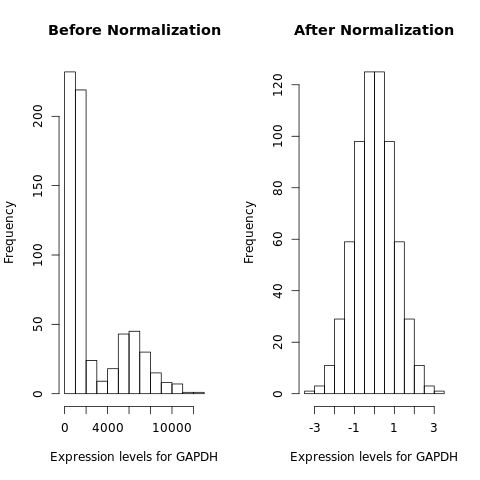
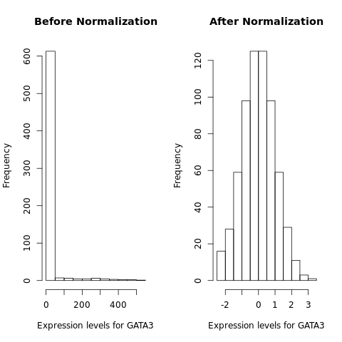
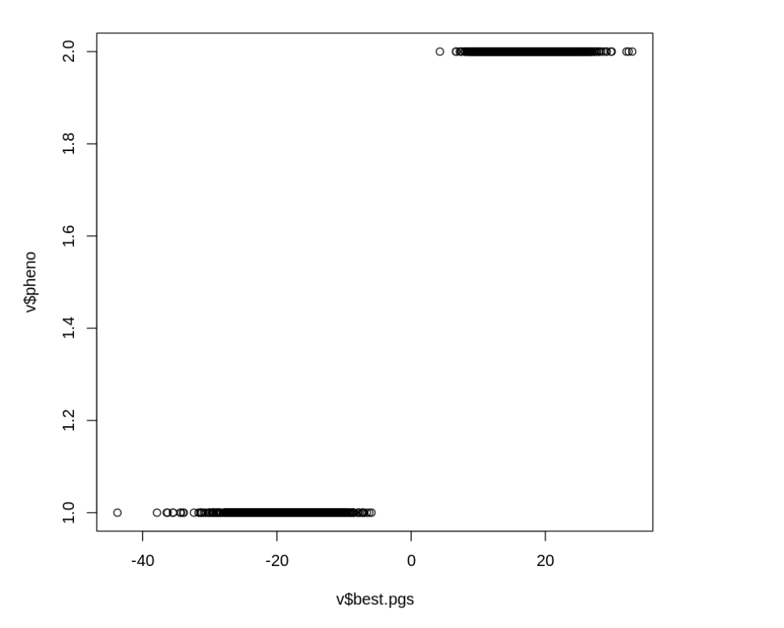
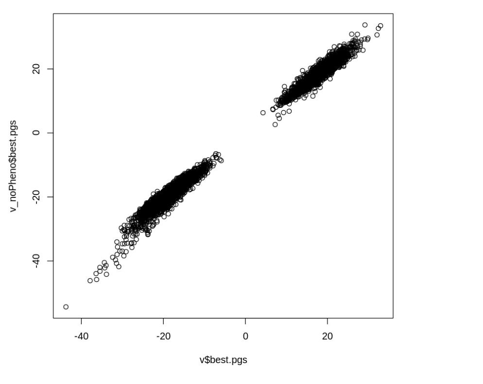
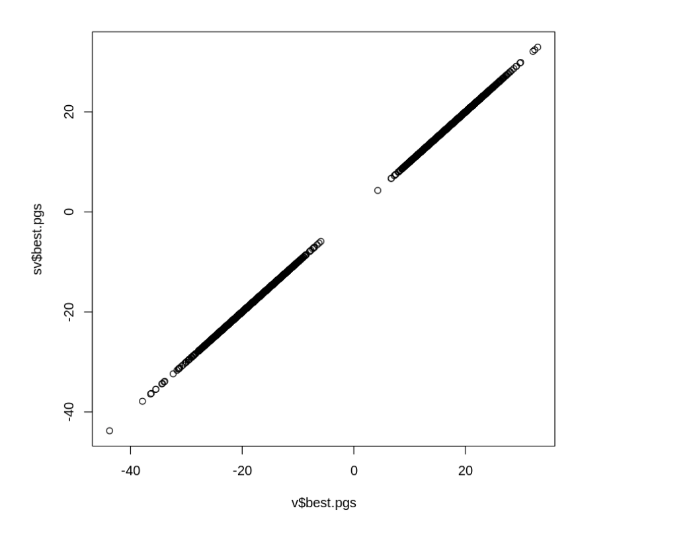
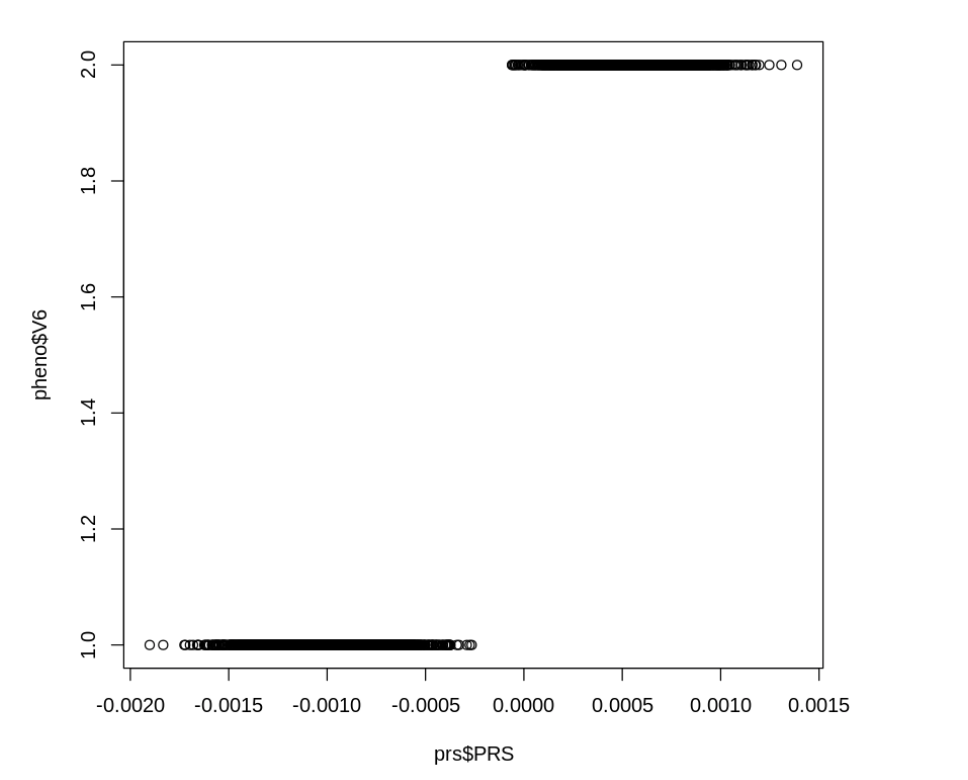

### Construct PGS for GTEx genotypes using Lassosum
* Base dataset: 
    -  GIANT height 2014 (summary statistics)
    -  CAD_2017: hg19
* Target datset:  
    - GTEx whole blood

### Overview of methods:
* PGS constructed using summary statistics and a reference panel under a penalized regression framework (LASSO)
* A general method for choosing tuning parameters without validation data
* Comparable prediction accuracy to the dataset with phenotype available
* Faster and more accurate than LDpred

### QC steps 
* base dataset   
    - remove ambiguous SNPs (15%)
    - identify and remove duplicated SNPs (0%)

### target dataset    
1.  WTCCC  
    - Human Genome Reference Assembly 17 (NCBI build 35)
    - Lift over to hg19

2. GTEx 
Filtering Steps based on 
     - filter snps by maf >= 0.05, hwe <1e-6, genotype missing >= 0.01 
     - filter inidividuals with >= 0.01 genotype missingness (5 excluded)
     - remove highly correlated SNPs
     - remove individuals with high or low heterzygosity rates (16 excluded)
     - For the remaining samples, only **654** of them have genotype information for whole blood tissue.

### Gene expression Quantification    
- Reads quantification
    read counts and TPM values were produced with RNA-SeQC v1.1.9* 
- Normalization (56200 genes -> 32387 genes)
    1. Trimmed mean of M-values (TMM) between each pair of samples
        * address the problem of a few genes expressed way more higher in one sample than the rest. Other genes may seem to be downregulated compared with spurious expression of a small number of genes
        * compute a set of scaling factors for the library sizes that minimize the log-fold changes between the samples for most genes.
    2. Filtered genes by gene expression >= 0.1 in at least 20% of samples 
    3. Expression values of each gene inversely normal transformed across samples
    
- Plots for Normalization




- Covariates:
    1. first five genotype PCs as covariates, which capture the major population structure among GTEx donors. 
    2. WGS sequencing platform and library protocol
    3. donor sex, age, ethnicity


### Results

* Evaluate the performance of lassosum on WTCCC dataset
 
Best parameter s = 0.5

 
Best parameter s = 0.2 for pseudovalidation
 

 
* Results from GTEx 
```{r}
f<-read.table("~/projects/polygenic_risks/workbooks/PRS_project/output/wb_summary_output_orig.txt", header = F, skip = 1, sep = " ")
hist(f$V5, xlab = "p-values", main = "Histogram of p values for expression variables")
qqplot(y = f$V5, x = 1:length(f$V5)/length(f$V5))
```

```{r}
#plink \
#    --bfile gtex_geno-temporary \
#    --make-bed \
#    --keep gtex_geno.valid.sample \
#    --out gtex_target.QC \
#    --extract gtex_geno.QC.snplist 
```

