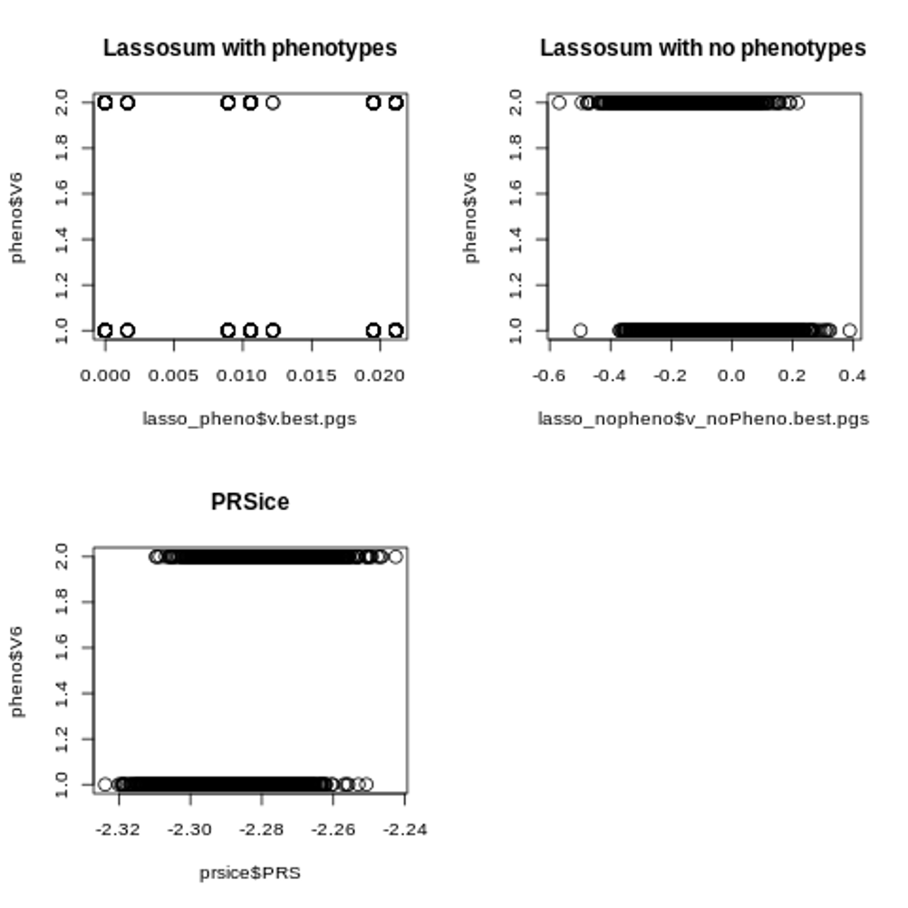
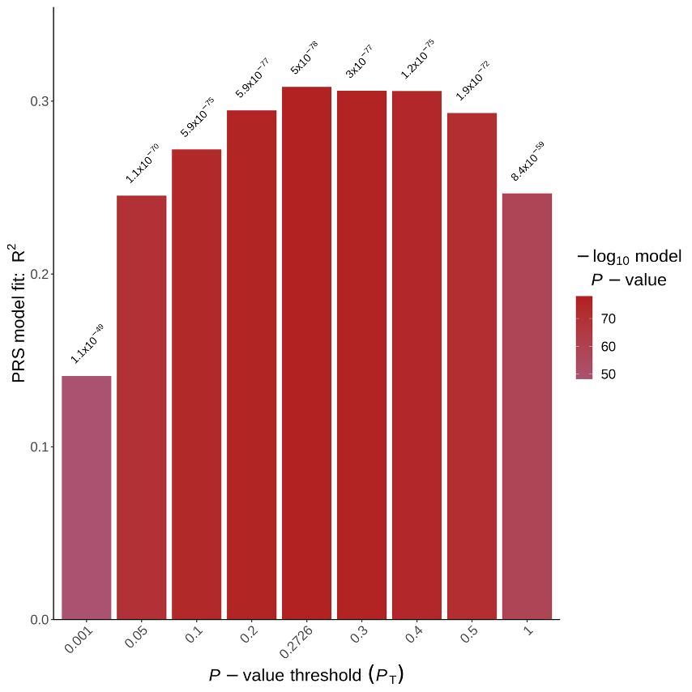

### Construct PGS for GTEx genotypes using Lassosum
* Base dataset: 
    -  GIANT height 2014 (summary statistics)
    -  CAD_2017: hg19
* Target datset:  
    - GTEx whole blood

### Overview of methods:
* PGS constructed using summary statistics and a reference panel under a penalized regression framework (LASSO)
* A general method for choosing tuning parameters without validation data
* Comparable prediction accuracy to the dataset with phenotype available
* Faster and more accurate than LDpred

### QC steps 
* base dataset   
    - remove ambiguous SNPs (15%)
    - identify and remove duplicated SNPs (0%)

### target dataset    
1.  WTCCC  
    - Human Genome Reference Assembly 17 (NCBI build 35)
    - Lift over to hg19

2. GTEx 
Filtering Steps based on 
     - filter snps by maf >= 0.05, hwe <1e-6, genotype missing >= 0.01 
     - filter inidividuals with >= 0.01 genotype missingness (5 excluded)
     - remove highly correlated SNPs
     - remove individuals with high or low heterzygosity rates (16 excluded)
     - For the remaining samples, only **654** of them have genotype information for whole blood tissue.

### Gene expression Quantification    
- Reads quantification
    read counts and TPM values were produced with RNA-SeQC v1.1.9* 
- Normalization (56200 genes -> 32387 genes)
    1. Trimmed mean of M-values (TMM) between each pair of samples
    {https://genomebiology.biomedcentral.com/articles/10.1186/gb-2010-11-3-r25}
        * address the problem of a few genes expressed way more higher in one sample than the rest. Other genes may seem to be downregulated compared with spurious expression of a small number of genes
        * compute a set of scaling factors for the library sizes that minimize the log-fold changes between the pair of samples for most genes.
    2. Filtered genes by gene expression >= 0.1 in at least 20% of samples 
    3. Expression values of each gene inversely normal transformed across samples
      * rank-based INT
      * convert to ranks, then transform to quantiles 
      * sample from inverse normal distributions


- Plots for Normalization
```{r echo = FALSE}
library(ggplot2)
library(reshape2)
final_expr<-read.table("~/projects/polygenic_risks/output/lassosum/wb_gene_expr_normalized.txt", header = T)
expr<-read.table("~/scratch-midway2/whole_blood_gene_expr.gz", header = T)
y<-read.table("./output/CD_best_pgs.txt", header = T)
full_samples<-read.table("~/scratch-midway2/gtex_plink/gtex_geno.valid.sample", header = T)
x<-melt(final_expr[, 20:30])
qplot(x = variable, y = value, data=x, geom = "boxplot",
 main="Normalized expression levels across individuals") + xlab("Sample ID") + ylab("Normalized gene expression levels")
```
- Check distributinos for specific genes's transcripts levels
```{r echo = FALSE}
par(mfrow = c(1, 2))
hist(as.numeric(expr[32632, -1:-2]), main = "Before Normalization", xlab = "Expression levels for GAPDH")
hist(as.numeric(final_expr[final_expr[, 2] == "GAPDH", -1:-2]), main = "After Normalization", xlab = "Expression levels for GAPDH")
hist(as.numeric(expr[7966, -1:-2]), main = "Before Normalization", xlab = "Expression levels for AC080125.1	")
hist(as.numeric(final_expr[final_expr[, 2] == "AC080125.1", -1:-2]), main = "After Normalization", xlab = "Expression levels for AC080125.1")

```
- Try log2 transformation
```{r echo = FALSE}
par(mfrow = c(1,2))
#try log transformations (cannot do log after being transformed into standard normal)
nf<-read.table("./output/TMM_norm_factors.txt", header = T)
tpm<-as.numeric(expr[7966,-1:-2])/nf$norm.factors
hist(as.numeric(final_expr[final_expr[, 2] == "AC080125.1", -1:-2]), main = "Inverse normal for AC080125.1", xlab = "gene expression")
hist(log2(tpm), main = "Log2 transformation", xlab = "gene expression")

tpm<-as.numeric(expr[32632,-1:-2])/nf$norm.factors
hist(as.numeric(final_expr[final_expr[, 2] == "GAPDH", -1:-2]), main = "Inverse normal for GAPDH", xlab = "gene expression")
hist(log2(tpm), main = "Log2 transformation", xlab = "gene expression")

# log2 transformation over quantile normalized gene expression 
# quantile_expr<-read.table("~/projects/polygenic_risks/output/lassosum/wb_gene_expr_quantile_normalized.txt", header = T)
# hist(as.numeric(quantile_expr[7966, -1:-2]), xlab = "quantile normalized expression levels")
# hist(log2(as.numeric(quantile_expr[7966, -1:-2])), xlab = "log2(quantile-nomalized expr)")
```


- Covariates:
    1. first five genotype PCs as covariates, which capture the major population structure among GTEx donors. 
    2. WGS sequencing platform and library protocol
    3. donor sex, age, ethnicity


### Results

* Evaluate the performance of lassosum and PRSice-2 on WTCCC dataset
 
 
 
* Results from GTEx 
```{r echo = FALSE}
summary_output<-function(trait){
  f<-read.table(sprintf("~/projects/polygenic_risks/workbooks/PRS_project/output/%s_vs_wb_lm_summary.txt", trait), header = F, skip = 1, sep = " ")
  par(mfrow = c(1, 2))
  colnames(f)<-c("Gene","Estimate", "Std_error", "t_value", "p_value")
  hist(f$p_value, xlab = "p-values", main = paste0(trait, "_trait"))
  qqplot(y = -log10(f$p_value), x = -log10(1:length(f$p_value)/length(f$p_value)), ylab = "-log10(Observerd P-values)", xlab = "-log10(Expected P-values)")
  abline(a = 0, b = 1, col = "red")
  print(paste0("The number of significant associations for the trait after FDR correction is ",   sum(p.adjust(f$p_value, method = "BH") <= 0.05)))
}

summary_output("CD")
summary_output("UC")
summary_output("IBD")

```
### Gene AC080125.1 has the strongest association with CD trait
```{r echo = FALSE}
samples<-unlist(lapply(colnames(final_expr)[-1:-2], function(i){
    return(paste(strsplit(i, "[.]")[[1]][1:2], collapse = "-"))
}))
#subsets of y in the same order as expression matrix
y<-y[unlist(lapply(samples, function(i){which(full_samples[,1] == i)})),]
plot(y = y, x = as.numeric(final_expr[final_expr[, 2] == "AC080125.1", -1:-2]),
     xlab = "Transcript levels of gene AC080125.1", ylab = "Polygenic risk scores")

```


